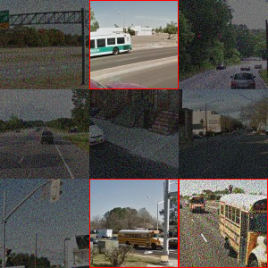

# DeCAPTCHA

This repository showcases a proof of concept where LLaVA, running on a MacBook Pro, effectively solves Google reCAPTCHA visual challenges, even with added noise and occlusion. This achievement marks a significant shift in the landscape of traditional visual CAPTCHA challenges, attributable to the emergence of LLMs and multimodal technologies.

```bash
> python decaptcha.py --target "bus" --preview 1 ./examples/noisy-bus.jpg
[INFO] Square 0:  0
[INFO] Square 1:  1
[INFO] Found match in square 1
[INFO] Square 2:  0
[INFO] Square 3:  0
[INFO] Square 4:  0
[INFO] Square 5:  0
[INFO] Square 6:  0
[INFO] Square 7:  1
[INFO] Found match in square 7
[INFO] Square 8:  1
[INFO] Found match in square 8
1,7,8
```




> ⚠️ It is crucial to understand that this approach does not represent a comprehensive solution for bypassing Google's reCAPTCHA. Google employs a multifaceted system that considers various factors, including users' interactions and behavior patterns before and during the reCAPTCHA challenges, to determine if the user is a bot.

## Prerequisites

- Python 3.6 or higher.
- Clone llama.cpp from [here](https://github.com/ggerganov/llama.cpp) and follow the instructions to build the project.
- Download one of the LLaVA v1.5 7b models from [here](https://huggingface.co/mys/ggml_llava-v1.5-7b/tree/main) along with the multimodal projector file `mmproj-model-f16.gguf`.
- Serve the model locally using the server executable in the llama.cpp repository as follows: `./server -m ./ggml-model-f16.gguf --mmproj ./mmproj-model-f16.gguf`.

## Installation

- Clone this repository.
- Install the requirements using `pip install -r requirements.txt`.

## Usage

- Download a reCAPTCHA image challenge from [here](https://www.google.com/recaptcha/api2/demo).
- Run the script with `python decaptcha.py --target "bus" --preview 1 ./examples/noisy-bus.jpg`.

```txt
usage: decaptcha.py [-h] --target TARGET [--preview PREVIEW] [--blur_radius BLUR_RADIUS] [--server_url SERVER_URL] [--log_level {DEBUG,INFO,WARNING,ERROR,CRITICAL}] [--prompt PROMPT] image_path

DeCAPTCHA

positional arguments:
  image_path            path to the image file

optional arguments:
  -h, --help            show this help message and exit
  --target TARGET       classification target
  --preview PREVIEW     show preview of the solution
  --blur_radius BLUR_RADIUS
                        radius for Gaussian blur
  --server_url SERVER_URL
                        llava server url
  --log_level {DEBUG,INFO,WARNING,ERROR,CRITICAL}
                        logging level
  --prompt PROMPT       classification prompt for llava
```

## Disclaimer

This is a proof of concept and is not intended for malicious use. Please act responsibly.
